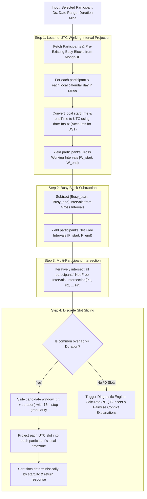

# Global Distributed Meeting Scheduler: Complete Feature & User Guide

Welcome to the **Distributed Meeting Scheduler**. This guide explains every feature, user workflow, mathematical concept, and interface component with step-by-step instructions and visual flowcharts.

---

## Table of Contents
1. [Core Purpose & Problem Solved](#1-core-purpose--problem-solved)
2. [High-Level System Architecture & Flowchart](#2-high-level-system-architecture--flowchart)
3. [Feature-by-Feature Guide](#3-feature-by-feature-guide)
   - [Feature 1: Participant Management](#feature-1-participant-management)
   - [Feature 2: Busy Blocks & Conflict Tracking](#feature-2-busy-blocks--conflict-tracking)
   - [Feature 3: 24-Hour UTC Working Window Matrix](#feature-3-24-hour-utc-working-window-matrix)
   - [Feature 4: Multi-Timezone Meeting Slot Optimizer](#feature-4-multi-timezone-meeting-slot-optimizer)
   - [Feature 5: Localized Multi-Participant Slot Cards](#feature-5-localized-multi-participant-slot-cards)
   - [Feature 6: Conflict Diagnostics & (N-1) Subset Suggestions](#feature-6-conflict-diagnostics--n-1-subset-suggestions)
   - [Feature 7: One-Click Assignment Preset & Reset](#feature-7-one-click-assignment-preset--reset)
4. [The Scheduling Algorithm Explained (Interval Math Flowchart)](#4-the-scheduling-algorithm-explained-interval-math-flowchart)
5. [Daylight Saving Time (DST) & Timezone Accuracy](#5-daylight-saving-time-dst--timezone-accuracy)
6. [Step-by-Step Hands-On Walkthrough](#6-step-by-step-hands-on-walkthrough)
   - [Scenario A: Finding 45-min slots for Maya (Bangalore) & Tom (London)](#scenario-a-finding-45-min-slots-for-maya-bangalore--tom-london)
   - [Scenario B: Adding a Busy Block to eliminate a slot](#scenario-b-adding-a-busy-block-to-eliminate-a-slot)
   - [Scenario C: 4-Way Global Meeting Diagnostic](#scenario-c-4-way-global-meeting-diagnostic)
7. [API Quick Reference](#7-api-quick-reference)

---

## 1. Core Purpose & Problem Solved

When coordinating meetings across distributed teams (e.g. Bangalore `Asia/Kolkata`, London `Europe/London`, San Francisco `America/Los_Angeles`, Sydney `Australia/Sydney`), organizers typically face three major challenges:
1. **Timezone Math Headaches**: Mental calculations fail around date boundaries, midnight crossings, and Daylight Saving Time shifts (e.g., US Spring Forward on March 8, 2026).
2. **Double-Booking Collisions**: Boundary errors occur when naive intervals overlap with existing meetings.
3. **The "Empty Void" Problem**: When no single meeting time fits everyone, standard calendar tools return an empty list without explaining *why* or suggesting *how* to compromise.

This application provides a **mathematically deterministic scheduling engine** that automatically computes mutually available intervals, projects times to every participant's local timezone, and suggests intelligent alternatives when no universal slot exists.

---

## 2. High-Level System Architecture & Flowchart

```mermaid
flowchart TD
    User([Coordinator / User])

    subgraph Frontend["React 18 + Tailwind UI"]
        UI_Nav["Navbar & Live UTC Clock"]
        UI_Form["Scheduling Config (Dates, Duration, Step)"]
        UI_Matrix["24-Hour UTC Timeline Matrix"]
        UI_Cards["Participant Cards & Busy Blocks"]
        UI_Results["Suggested Slots Grid"]
        UI_Alt["Diagnostics & (N-1) Suggestions"]
    end

    subgraph Backend["Express Layered Backend"]
        MW["Security, Rate Limiting & Validation (Zod)"]
        CTRL["Lean Controllers"]
        SVC_Sched["Scheduling Service (Interval Math)"]
        SVC_Part["Participant & Meeting Services"]
        REPO["Repository Abstractions"]
    end

    subgraph DB["MongoDB Persistence"]
        DB_Part[("Participants Collection\nUnique Email Index\nIANA Validator")]
        DB_Meet[("Meetings Collection\nCompound Time Index\nInvariant Hooks")]
    end

    User -->|1. Configures parameters & selects team| UI_Form
    UI_Form -->|POST /api/scheduling/slots| MW
    MW --> CTRL
    CTRL --> SVC_Sched
    SVC_Sched --> SVC_Part
    SVC_Part --> REPO
    REPO --> DB_Part
    REPO --> DB_Meet
    DB_Part --> REPO
    DB_Meet --> REPO
    REPO --> SVC_Sched
    SVC_Sched -->|Universal Slots Found| UI_Results
    SVC_Sched -->|Zero Match -> Calculate (N-1) Subsets| UI_Alt
```

---

## 3. Feature-by-Feature Guide

### Feature 1: Participant Management
* **What it does**: Allows the coordinator to create, edit, view, and delete participants.
* **Key Fields**:
  * **Full Name** & **Email Address** (enforces uniqueness at UI, API, and MongoDB index layers).
  * **Location** (e.g., Bangalore, London, San Francisco, Sydney).
  * **IANA Timezone Identifier** (e.g., `Asia/Kolkata`, `Europe/London`, `America/Los_Angeles`, `Australia/Sydney`).
  * **Normal Working Hours**: Start time and End time in local 24-hour format (e.g. `09:00` to `18:00`).
  * **Active Working Days**: Toggle buttons for Monday through Sunday.
* **How to use**:
  1. Click **Add Participant** in the top navigation bar.
  2. Fill in the name, email, location, choose an IANA timezone from the dropdown, and specify working hours.
  3. Click **Create Participant**.

---

### Feature 2: Busy Blocks & Conflict Tracking
* **What it does**: Tracks pre-existing calendar meetings and unavailable blocks for each participant.
* **Conflict Guarantee**: The scheduling engine guarantees that **no suggested slot will ever overlap with a busy block**.
* **How to use**:
  1. Find the participant card on the dashboard (e.g., **Maya**).
  2. Click **+ Add Busy Block**.
  3. Enter a meeting title (e.g., *Client Review Sync*), start date/time, and end date/time in UTC.
  4. Click **Log Busy Block**.

---

### Feature 3: 24-Hour UTC Working Window Matrix
* **What it does**: Renders an interactive 24-hour visual comparison bar for every participant relative to UTC.
* **Visual Key**:
  * 🟩 **Green Blocks (`•`)**: Participant is in their active local working hours.
  * ⬛ **Dark Blocks**: Participant is in off-hours or sleeping.
* **Why it matters**: Gives coordinators immediate visual intuition about regional overlap. For example, you can immediately see why London and Bangalore overlap around 08:00–12:30 UTC, while San Francisco and Sydney have completely disjoint normal hours.

```text
24-Hour Working Matrix Example:
Hour (UTC): 00 01 02 03 04 05 06 07 08 09 10 11 12 13 14 15 16 17 18 19 20 21 22 23
Maya (BLR): [   OFF   ] [••••••••••••••••••] [           OFF           ]
Tom  (LON): [       OFF       ] [••••••••••••••••••] [       OFF       ]
Sara (SFO): [               OFF                ] [••••••••••••••••••] [  OFF  ]
Jack (SYD): [••••••••••] [                 OFF                 ] [••••••••••••]
```

---

### Feature 4: Multi-Timezone Meeting Slot Optimizer
* **What it does**: The central form that calculates matching slots based on user criteria.
* **Parameters**:
  * **Start Date & End Date**: Target scheduling window (defaults to `2026-03-08` to `2026-03-14`).
  * **Meeting Duration**: Dropdown with 15m, 30m, 45m (assignment default), 60m, 90m, 120m options.
  * **Alignment Granularity**: 15 min, 30 min, or 60 min discrete stepping.
  * **Participant Checkboxes**: Select or deselect participants dynamically.
* **How to use**:
  1. Select the participants you want in the meeting using the checkboxes on their cards.
  2. Select your date range and meeting duration (e.g. 45 mins).
  3. Click **Calculate Optimal Meeting Slots**.

---

### Feature 5: Localized Multi-Participant Slot Cards
* **What it does**: When valid meeting slots are found, each slot is presented as a card containing:
  * **Universal UTC Window**: `Mon, 09 Mar 2026 08:00:00 – 08:45:00 UTC`.
  * **Individual Local Time Cards**:
    * **Maya (Bangalore)**: `1:30 PM – 2:15 PM (IST)`
    * **Tom (London)**: `8:00 AM – 8:45 AM (GMT)`
  * **Midnight Spanning Badges**: Warns if a meeting crosses midnight in any participant's local timezone.

---

### Feature 6: Conflict Diagnostics & (N-1) Subset Suggestions
* **What it does**: When all selected participants cannot meet simultaneously (0 universal slots), the application **never displays an empty screen**.
* **Intelligent Output**:
  1. **Root-Cause Incompatibility Cards**: Explains which participant pairs have 0 hours of mutual overlap.
  2. **(N-1) Compromise Subsets**: Computes the best combinations where $N-1$ participants can meet, detailing who is excluded and what time it would be in their timezone if they were to join.
  3. **Actionable Suggestions**: Recommends splitting the meeting, holding an asynchronous update, or adjusting working window flexibility.

---

### Feature 7: One-Click Assignment Preset & Reset
* **What it does**: Instantly restores the exact scenario required by the assignment specification:
  * **Maya**: Bangalore (`Asia/Kolkata`, 09:00–18:00)
  * **Tom**: London (`Europe/London`, 08:00–17:00)
  * **Sara**: San Francisco (`America/Los_Angeles`, 06:00–15:00)
  * **Jack**: Sydney (`Australia/Sydney`, 10:00–19:00)
  * **Window**: 8–14 March 2026, 45-minute duration.
* **How to use**: Click **Reset Seed Scenario** in the top navigation bar or **Load Assignment Spec** on the form.

---

## 4. The Scheduling Algorithm Explained (Interval Math Flowchart)

The algorithm treats all time ranges as **half-open intervals $[start, end)$ in canonical UTC epoch milliseconds**.



---

## 5. Daylight Saving Time (DST) & Timezone Accuracy

The scheduling engine uses real IANA timezone calculations (`date-fns-tz`) rather than naive fixed offsets.

### Real Example: US Daylight Saving Shift on March 8, 2026
In `America/Los_Angeles`, clocks spring forward 1 hour on Sunday, March 8, 2026:
* **Saturday, March 7 (PST = UTC-8)**: Local `06:00` $\to$ `14:00 UTC`.
* **Monday, March 9 (PDT = UTC-7)**: Local `06:00` $\to$ `13:00 UTC`.

The system automatically calculates this 1-hour time shift for Sara in San Francisco, guaranteeing that schedules remain exact across the DST boundary.

---

## 6. Step-by-Step Hands-On Walkthrough

### Scenario A: Finding 45-min slots for Maya (Bangalore) & Tom (London)
1. In the Participants list, ensure only **Maya** and **Tom** are checked.
2. In the Scheduling form:
   * **Start Date**: `2026-03-08`
   * **End Date**: `2026-03-14`
   * **Meeting Duration**: `45 mins`
3. Click **Calculate Optimal Meeting Slots**.
4. **Outcome**: You will receive **multiple suggested slots** (e.g. `08:00–08:45 UTC`, `08:15–09:00 UTC`, etc.).
   * In Maya's local time: `1:30 PM – 2:15 PM IST`
   * In Tom's local time: `8:00 AM – 8:45 AM GMT`

---

### Scenario B: Adding a Busy Block to eliminate a slot
1. On **Maya's** card, click **+ Add Busy Block**.
2. Set:
   * **Title**: `Architecture Discussion`
   * **Start Time (UTC)**: `2026-03-09 08:00`
   * **End Time (UTC)**: `2026-03-09 09:30`
3. Click **Log Busy Block**.
4. Click **Calculate Optimal Meeting Slots** again.
5. **Outcome**: The slots during `08:00–09:30 UTC` on Monday, March 9 are **automatically eliminated**, showing next available slots starting from `09:30 UTC` (`3:00 PM IST`).

---

### Scenario C: 4-Way Global Meeting Diagnostic
1. Check all 4 participants (**Maya**, **Tom**, **Sara**, **Jack**).
2. Click **Calculate Optimal Meeting Slots**.
3. **Outcome**: The system identifies that because Bangalore (UTC+5:30), London (UTC+0), San Francisco (UTC-7), and Sydney (UTC+11) span 19 hours across the globe, there is **no single working hour window where all 4 can meet without one person being in off-hours**.
4. The system automatically renders:
   * **Pairwise Incompatibility Diagnostics**: Explains why San Francisco and Bangalore/Sydney have 0 overlap during standard hours.
   * **(N-1) Subset Suggestions**: Proposes meeting slots for Maya + Tom + Sara (with Jack's local time noted), or Maya + Tom + Jack (with Sara's local time noted).

---

## 7. API Quick Reference

| Method | Endpoint | Purpose | Sample Request Body |
|---|---|---|---|
| `GET` | `/api/health` | Service uptime and DB status | *None* |
| `GET` | `/api/participants` | Fetch all participants | *None* |
| `POST` | `/api/participants` | Create a participant | `{"name":"Maya","email":"maya@team.com","location":"Bangalore","timezone":"Asia/Kolkata","availability":{"startTime":"09:00","endTime":"18:00","daysOfWeek":[1,2,3,4,5]}}` |
| `PUT` | `/api/participants/:id` | Update participant details | `{"location":"Bangalore Central"}` |
| `DELETE` | `/api/participants/:id` | Delete participant + cascade meetings | *None* |
| `POST` | `/api/participants/:id/meetings` | Record a busy block | `{"title":"Client Sync","startTime":"2026-03-09T08:00:00Z","endTime":"2026-03-09T09:00:00Z"}` |
| `DELETE` | `/api/meetings/:id` | Delete a busy block | *None* |
| `POST` | `/api/scheduling/slots` | Calculate matching slots | `{"participantIds":["..."],"startDate":"2026-03-08","endDate":"2026-03-14","durationMinutes":45,"granularityMinutes":15}` |
| `POST` | `/api/seed` | Reset seed data to assignment defaults | `{"reset": true}` |
